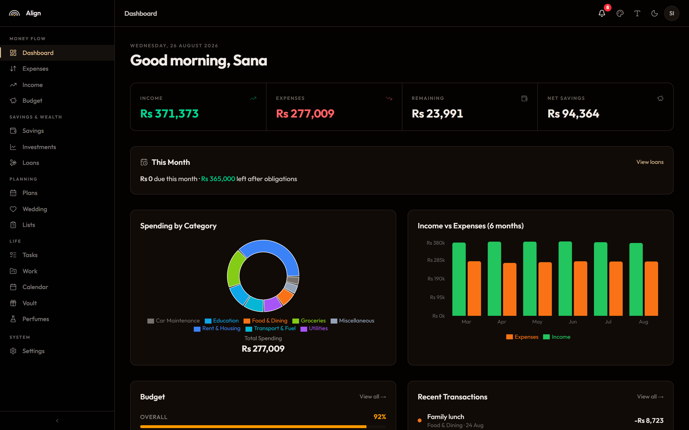
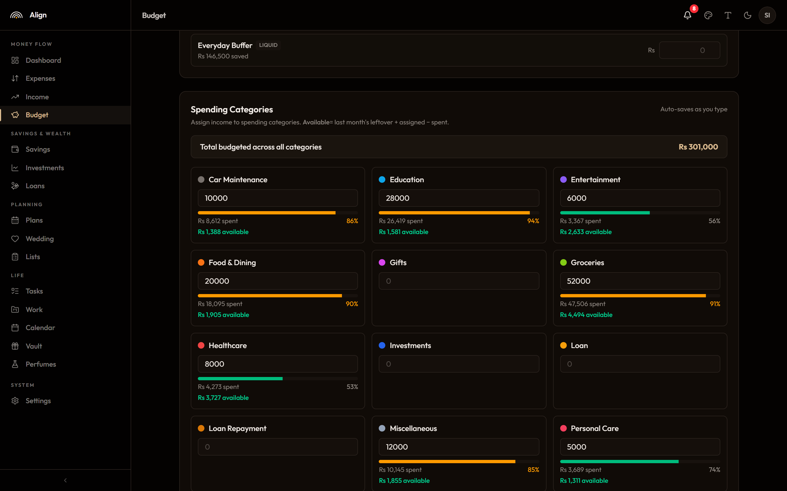
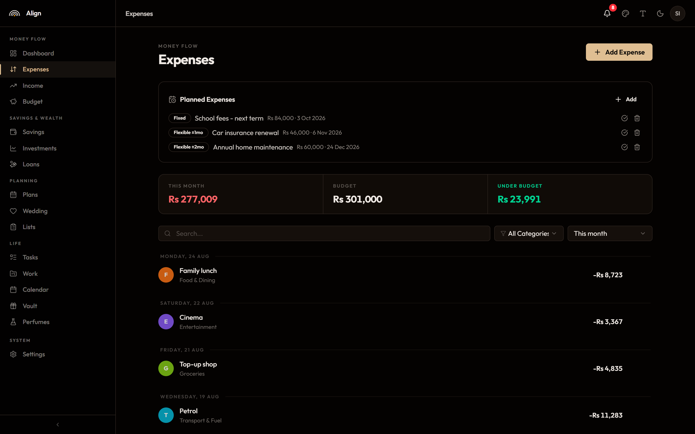
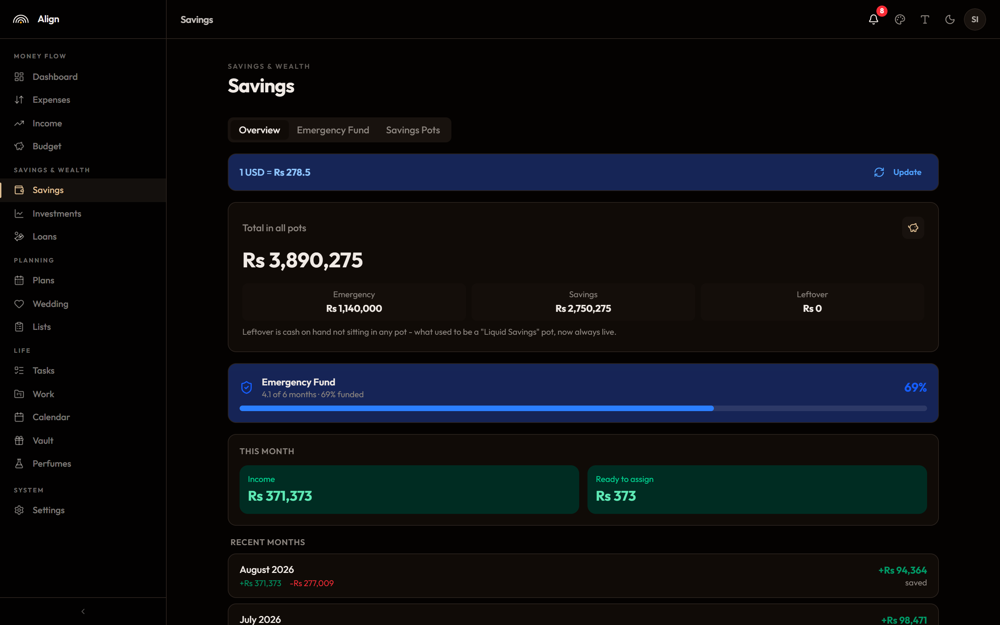
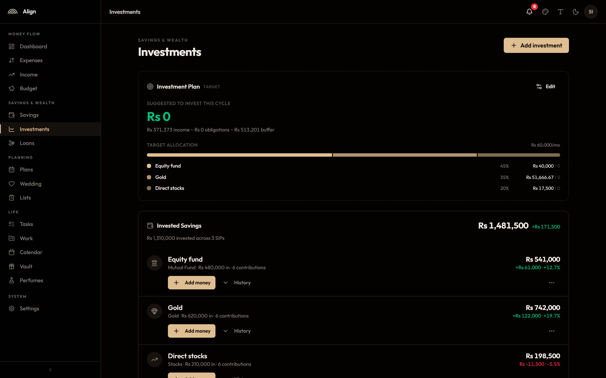
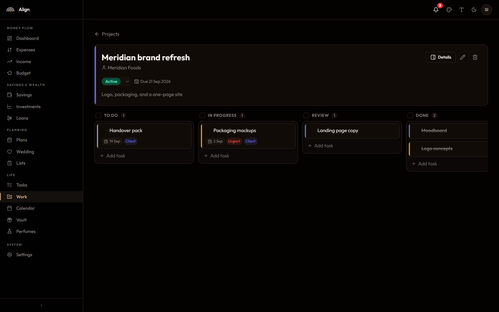

<div align="center">

# Align

Personal finance app I built to run our household money. Self-hosted, so the data lives in a database you own. Comes with a web app and an Android app that share one backend.

[](../../actions/workflows/web-ci.yml)
[](../../actions/workflows/mobile-ci.yml)
[](LICENSE)

</div>

Runs on the free tiers of Vercel and Neon, so hosting it costs nothing. Nobody sees your numbers but you.

## What it does

The core is a zero-based budget: income comes in, you assign all of it, and money can't leave a bucket without saying where it came from. Around that there's:

- Expenses and income with categories, tags, and recurring entries
- Savings pots in PKR and USD (emergency, liquid, general), with deposits that have to declare a source
- Goals, investments, and loans (settling a loan logs the expense for you, with repayment schedules and a forward cash-flow projection)
- Tasks (daily habits, one-offs, and checklists) and a Projects board for freelance/client work
- A planner for big life events, a calendar, and want/need lists
- A private gift planner that only the super admin can see

The exchange rate between PKR and USD syncs once a day. There are two roles: super admin (everything) and admin (everything except the vault and user management).

## What it looks like

|  |  |
| --- | --- |
|  |  |
| **Dashboard** - month at a glance, spend by category, six-month trend | **Budget** - every category with what is left in it, overspend in red |
|  |  |
| **Expenses** - grouped by day, with upcoming planned expenses on top | **Savings** - pots in PKR and USD, emergency fund coverage in months |
|  |  |
| **Investments** - SIPs with contributions and gain/loss per holding | **Work** - a board per project for freelance and client jobs |

Screens above are the demo dataset, not real numbers - `pnpm seed:demo` builds it (see [CONTRIBUTING.md](CONTRIBUTING.md#demo-data)).

## How it's laid out

```
align/
  apps/
    web/      Next.js + Prisma + Postgres. The app, plus the REST API.
    mobile/   Flutter Android client. Talks to /api/v1.
  docs/
  .github/    CI, split so web changes don't run the Flutter build.
```

The web app owns the database and exposes the API the phone app uses. If you only want the web app, you never have to touch the mobile side.

## Running the web app

You need a free Postgres database. A [Neon](https://neon.tech) branch is the easiest.

```bash
cd apps/web
cp .env.example .env.local     # fill in your database URL and secrets
pnpm install
pnpm exec prisma migrate dev   # creates the tables
pnpm seed                      # creates your login(s)
pnpm dev                       # http://localhost:3000
```

Longer version in [apps/web/README.md](apps/web/README.md). Deploying to Vercel is in [apps/web/DEPLOYMENT.md](apps/web/DEPLOYMENT.md).

Want to call it something other than "Align"? Set `NEXT_PUBLIC_APP_NAME` and it changes everywhere in the UI.

### Or with Docker

Brings up Postgres and the web app together — no local Node or Postgres needed:

```bash
cp .env.docker.example .env    # then set the three secrets it lists
docker compose up --build      # http://localhost:3000
```

The database starts first, migrations run automatically, and (with
`SEED_ON_START=true`) a first admin user is created from the `USER1_*` values in
your `.env`. Postgres is exposed on `localhost:5434` if you want to poke at it.

## Running the mobile app

```bash
cd apps/mobile
fvm flutter pub get
fvm dart run build_runner build --delete-conflicting-outputs
fvm flutter run
```

On first launch the app asks for your server address - nothing is baked in at build time, so one APK works against any instance. Change it later in Settings.

More in [apps/mobile/README.md](apps/mobile/README.md). Pass `--dart-define=APP_NAME=YourName` to rename it there too.

Prefer not to build it yourself? Signed APKs are published on [GitHub Releases](../../releases) on every version bump - install one, point it at your own server on first launch, and let [Obtainium](https://github.com/ImranR98/Obtainium) track updates from this repo.

## Stack

Web is Next.js 16, React 19, Prisma 7, Postgres, NextAuth v5, and Tailwind v4. Mobile is Flutter with Riverpod, GoRouter, and Dio, laid out in clean-architecture slices. Both host on free tiers.

## More docs

- [ARCHITECTURE.md](ARCHITECTURE.md) covers how the money rules work. Read it before you touch anything financial.
- [CONTRIBUTING.md](CONTRIBUTING.md) has the dev setup and the house rules.
- [SECURITY.md](SECURITY.md) is how to report something sensitive.
- [HANDOFF.md](HANDOFF.md) - current project status, what's pending, notes for picking this back up.

## License

MIT. See [LICENSE](LICENSE).
