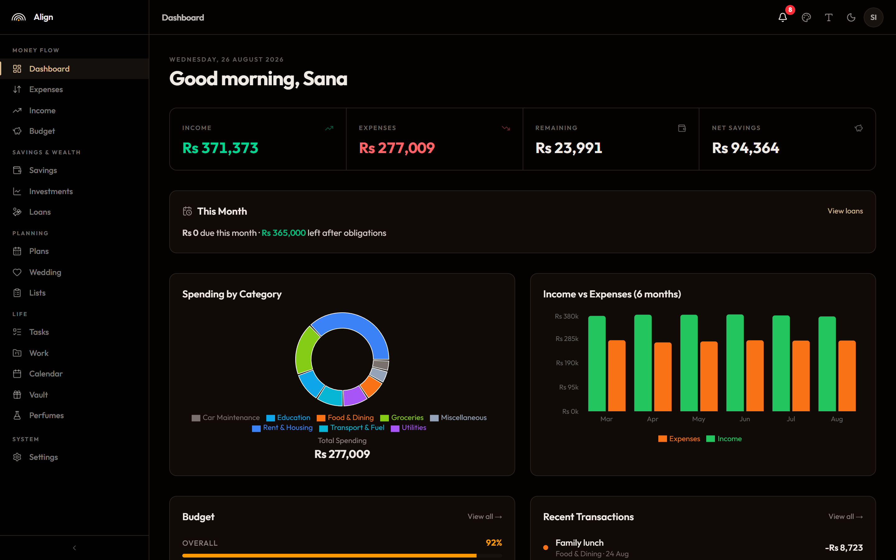
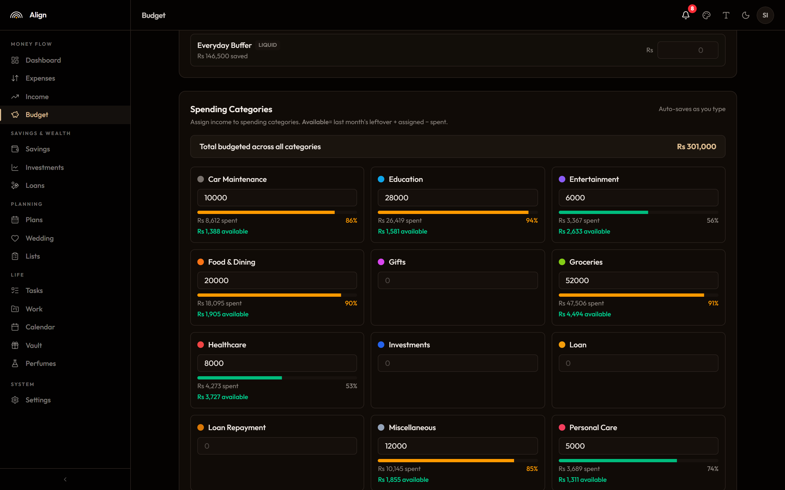
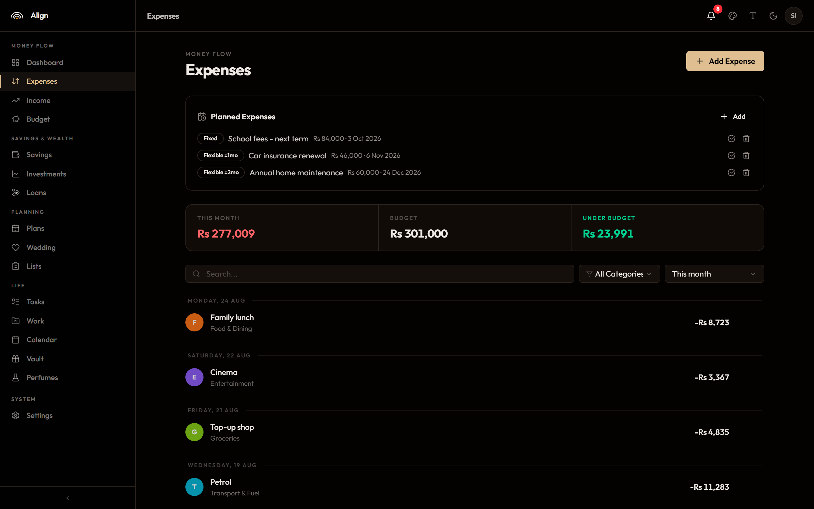
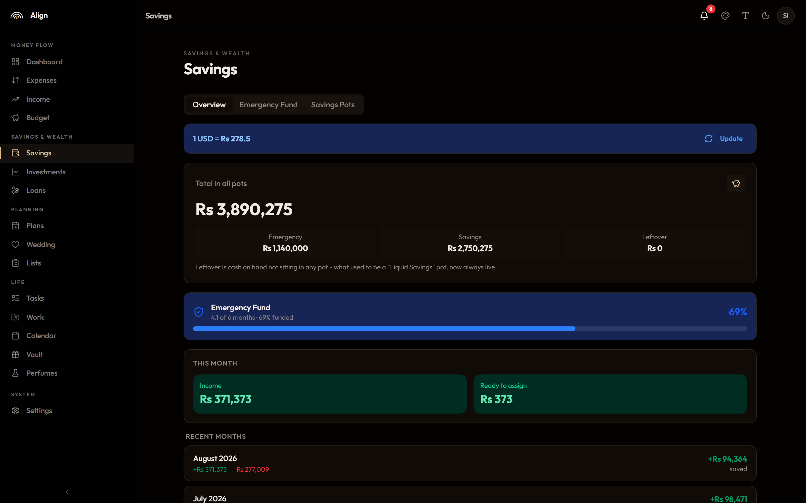
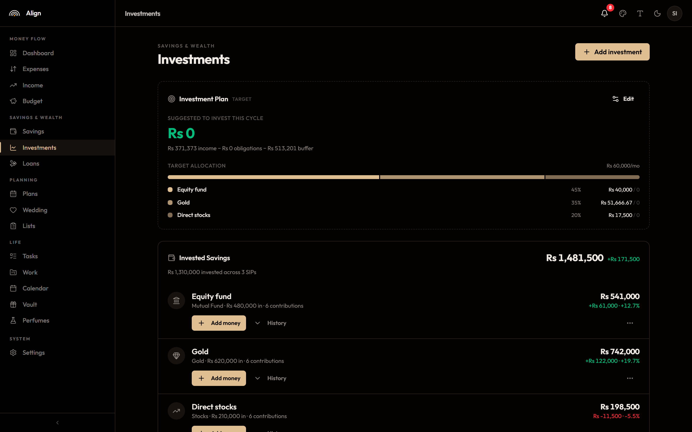
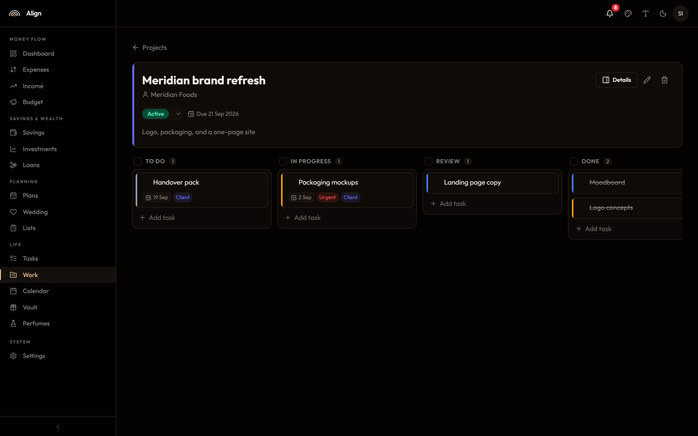

<div align="center">

# Align

Personal finance app I built to run our household money. Self-hosted, so the data lives in a database you own. Comes with a web app and an Android app that share one backend.

[](../../actions/workflows/web-ci.yml)
[](../../actions/workflows/mobile-ci.yml)
[](LICENSE)

</div>

Runs on the free tiers of Vercel and Neon, so hosting it costs nothing. Nobody sees your numbers but you.

## What it does

The core is a zero-based budget: income comes in, you assign all of it, and money can't leave a bucket without saying where it came from. Around that there's:

- Expenses and income with categories, tags, and recurring entries
- Savings pots that hold a balance per currency (PKR is the base, USD comes set up, add your own), with deposits that have to declare a source. A pot with a target and deadline is a savings goal
- Investments with deposits and withdrawals (each optionally booked as an expense or income) and loans you can top up, repay, or write off (settling a loan logs the expense for you, with repayment schedules and a forward cash-flow projection)
- Tasks (daily habits and one-offs) and a Work board for freelance/client projects
- Plans for big life events, a dedicated wedding planner, a calendar, and want/need lists
- A perfume collection tracker, and a private gift planner that only the super admin can see
- Optional TOTP two-factor login

Currencies and their rates live in Settings. The USD rate can sync itself once a day if you schedule the daily cron job (see [DEPLOYMENT.md](apps/web/DEPLOYMENT.md#daily-cron-job)); otherwise you set rates by hand. There are two roles: super admin (everything) and admin (everything except the vault and user management).

## What it looks like

|  |  |
| --- | --- |
|  |  |
| **Dashboard** - month at a glance, spend by category, six-month trend | **Budget** - every category with what is left in it, overspend in red |
|  |  |
| **Expenses** - grouped by day, with upcoming planned expenses on top | **Savings** - pots in PKR and USD, emergency fund coverage in months |
|  |  |
| **Investments** - SIPs with contributions and gain/loss per holding | **Work** - a board per project for freelance and client jobs |

Screens above are the demo dataset, not real numbers - `pnpm seed:demo` builds it (see [docs/LOCAL_DEVELOPMENT.md](docs/LOCAL_DEVELOPMENT.md#optional-fill-it-with-demo-data)).

## How it's laid out

```
align/
  apps/
    web/      Next.js + Prisma + Postgres. The app, the REST API, and the Docker setup.
    mobile/   Flutter Android client. Talks to /api/v1.
  docs/
  .github/    CI, split so web changes don't run the Flutter build.
```

The web app owns the database and exposes the API the phone app uses. If you only want the web app, you never have to touch the mobile side.

## Running it

**Locally:** [docs/LOCAL_DEVELOPMENT.md](docs/LOCAL_DEVELOPMENT.md) walks through the whole thing - a Postgres in Docker, the web app, and optionally the Android app pointed at it. The short version, from `apps/web`:

```bash
docker compose up -d db && cp .env.example .env.local   # then fill in .env.local
pnpm install && pnpm exec prisma generate && pnpm exec prisma migrate dev
pnpm seed && pnpm dev                                    # http://localhost:3000
```

**On the internet:** [apps/web/DEPLOYMENT.md](apps/web/DEPLOYMENT.md) deploys the web app to Vercel + Neon for free. The phone app then connects to that address.

Want to call it something other than "Align"? Set `NEXT_PUBLIC_APP_NAME` and it changes everywhere in the web UI (the Android app is always "Align").

Prefer not to build it yourself? Signed APKs are published on [GitHub Releases](../../releases) on every version bump - install one, point it at your own server on first launch, and let [Obtainium](https://github.com/ImranR98/Obtainium) track updates from this repo.

## Stack

Web is Next.js 16, React 19, Prisma 7, Postgres, better-auth (with TOTP two-factor), and Tailwind v4. Mobile is Flutter with Riverpod, GoRouter, and Dio, laid out in clean-architecture slices. Both host on free tiers.

## More docs

- [docs/LOCAL_DEVELOPMENT.md](docs/LOCAL_DEVELOPMENT.md) - running both apps on your machine.
- [apps/web/DEPLOYMENT.md](apps/web/DEPLOYMENT.md) - putting the web app online (Vercel + Neon).
- [ARCHITECTURE.md](ARCHITECTURE.md) covers how the money rules work. Read it before you touch anything financial.
- [CONTRIBUTING.md](CONTRIBUTING.md) has the checks and the house rules.
- [SECURITY.md](SECURITY.md) is how to report something sensitive.
- [HANDOFF.md](HANDOFF.md) - current project status, what's pending, notes for picking this back up.

## License

MIT. See [LICENSE](LICENSE).
